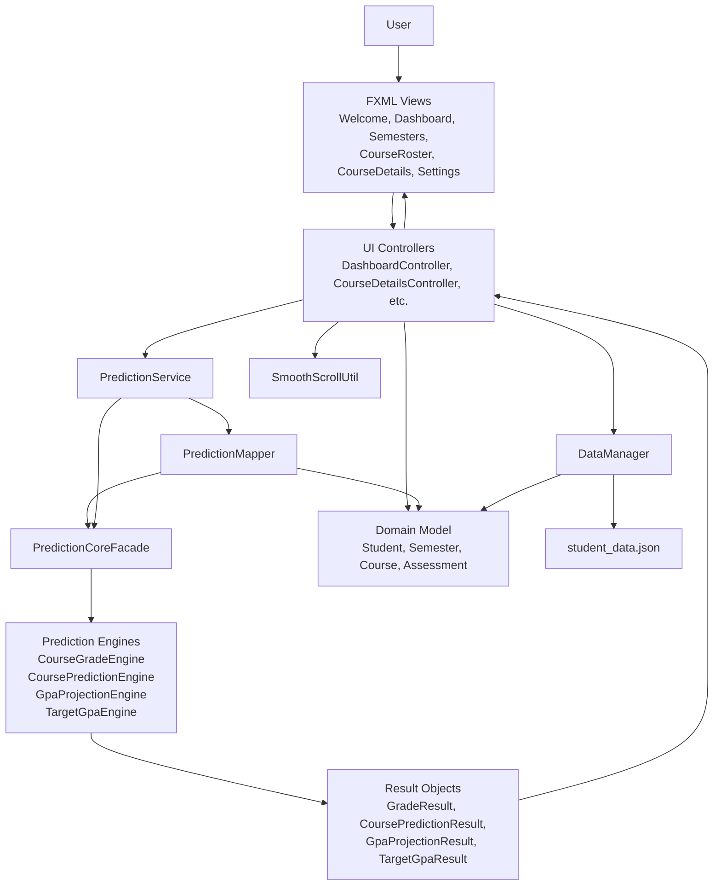

# Architecture Diagram

Key rule:

- UI/controllers call prediction through `PredictionService`, `PredictionMapper`, and `PredictionCoreFacade`.
- `com.academictracker.prediction2` stays independent from JavaFX, FXML, Gson, and controllers.

