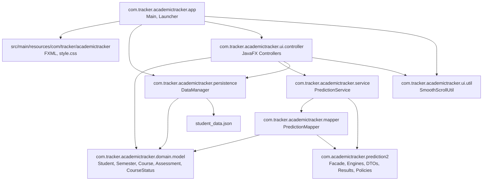

# Package Diagram

```mermaid
flowchart TD
    app["com.tracker.academictracker.app<br/>Main, Launcher"]
    controller["com.tracker.academictracker.ui.controller<br/>JavaFX Controllers"]
    util["com.tracker.academictracker.ui.util<br/>SmoothScrollUtil"]
    model["com.tracker.academictracker.domain.model<br/>Student, Semester, Course, Assessment, CourseStatus"]
    persistence["com.tracker.academictracker.persistence<br/>DataManager"]
    service["com.tracker.academictracker.service<br/>PredictionService"]
    mapper["com.tracker.academictracker.mapper<br/>PredictionMapper"]
    core["com.academictracker.prediction2<br/>Facade, Engines, DTOs, Results, Policies"]
    resources["src/main/resources/com/tracker/academictracker<br/>FXML, style.css"]
    json["student_data.json"]

    app --> resources
    app --> persistence
    app --> controller
    app --> util
    controller --> model
    controller --> service
    controller --> persistence
    controller --> util
    service --> mapper
    service --> core
    mapper --> model
    mapper --> core
    persistence --> model
    persistence --> json
```

Important dependency rule:

- `com.academictracker.prediction2` should not depend on JavaFX, FXML, Gson, controllers, or `DataManager`.

