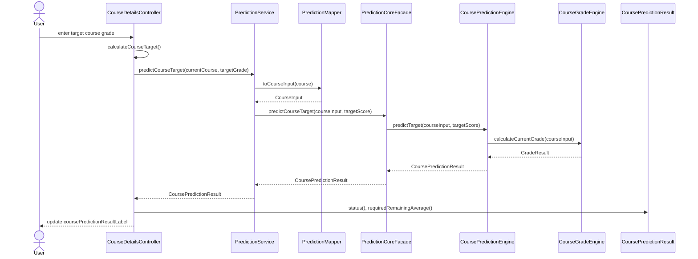

# Sequence Diagram — Course Target Grade Prediction

```mermaid
sequenceDiagram
    actor User
    participant CourseDetailsController
    participant PredictionService
    participant PredictionMapper
    participant PredictionCoreFacade
    participant CoursePredictionEngine
    participant CourseGradeEngine
    participant CoursePredictionResult

    User->>CourseDetailsController: enter target course grade
    CourseDetailsController->>CourseDetailsController: calculateCourseTarget()
    CourseDetailsController->>PredictionService: predictCourseTarget(currentCourse, targetGrade)
    PredictionService->>PredictionMapper: toCourseInput(course)
    PredictionMapper-->>PredictionService: CourseInput
    PredictionService->>PredictionCoreFacade: predictCourseTarget(courseInput, targetScore)
    PredictionCoreFacade->>CoursePredictionEngine: predictTarget(courseInput, targetScore)
    CoursePredictionEngine->>CourseGradeEngine: calculateCurrentGrade(courseInput)
    CourseGradeEngine-->>CoursePredictionEngine: GradeResult
    CoursePredictionEngine-->>PredictionCoreFacade: CoursePredictionResult
    PredictionCoreFacade-->>PredictionService: CoursePredictionResult
    PredictionService-->>CourseDetailsController: CoursePredictionResult
    CourseDetailsController->>CoursePredictionResult: status(), requiredRemainingAverage()
    CourseDetailsController-->>User: update coursePredictionResultLabel
```

