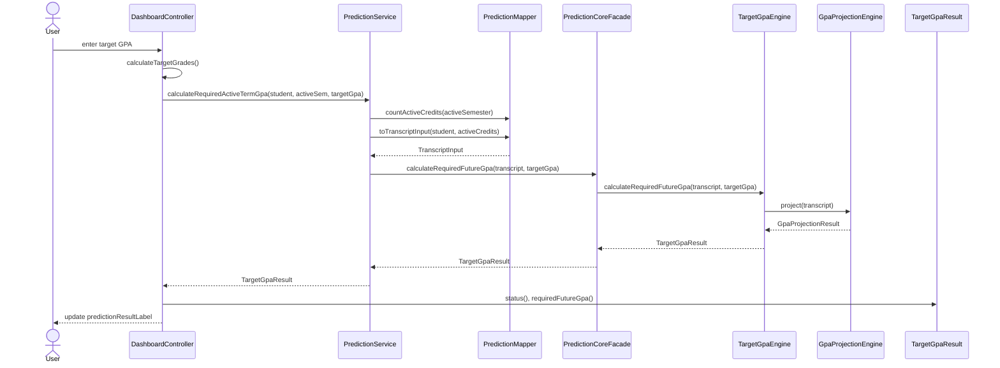

# Sequence Diagram — Target GPA Calculation

```mermaid
sequenceDiagram
    actor User
    participant DashboardController
    participant PredictionService
    participant PredictionMapper
    participant PredictionCoreFacade
    participant TargetGpaEngine
    participant GpaProjectionEngine
    participant TargetGpaResult

    User->>DashboardController: enter target GPA
    DashboardController->>DashboardController: calculateTargetGrades()
    DashboardController->>PredictionService: calculateRequiredActiveTermGpa(student, activeSem, targetGpa)
    PredictionService->>PredictionMapper: countActiveCredits(activeSemester)
    PredictionService->>PredictionMapper: toTranscriptInput(student, activeCredits)
    PredictionMapper-->>PredictionService: TranscriptInput
    PredictionService->>PredictionCoreFacade: calculateRequiredFutureGpa(transcript, targetGpa)
    PredictionCoreFacade->>TargetGpaEngine: calculateRequiredFutureGpa(transcript, targetGpa)
    TargetGpaEngine->>GpaProjectionEngine: project(transcript)
    GpaProjectionEngine-->>TargetGpaEngine: GpaProjectionResult
    TargetGpaEngine-->>PredictionCoreFacade: TargetGpaResult
    PredictionCoreFacade-->>PredictionService: TargetGpaResult
    PredictionService-->>DashboardController: TargetGpaResult
    DashboardController->>TargetGpaResult: status(), requiredFutureGpa()
    DashboardController-->>User: update predictionResultLabel
```

